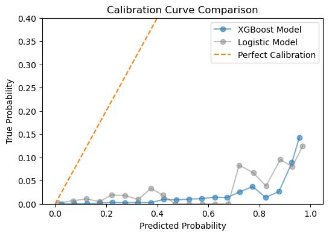
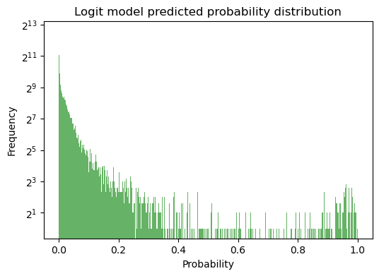
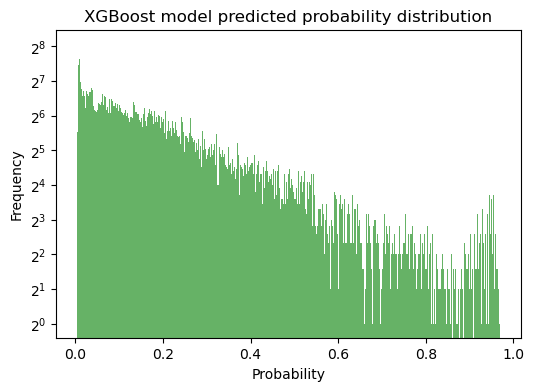
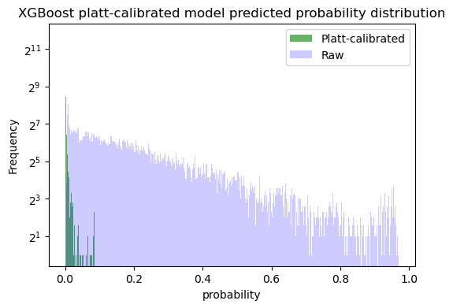
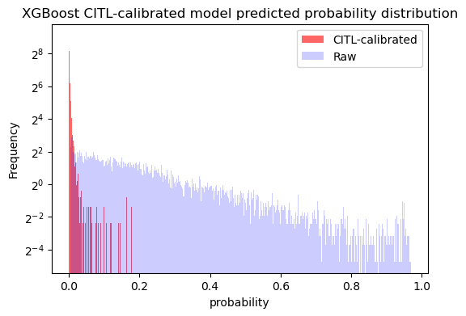
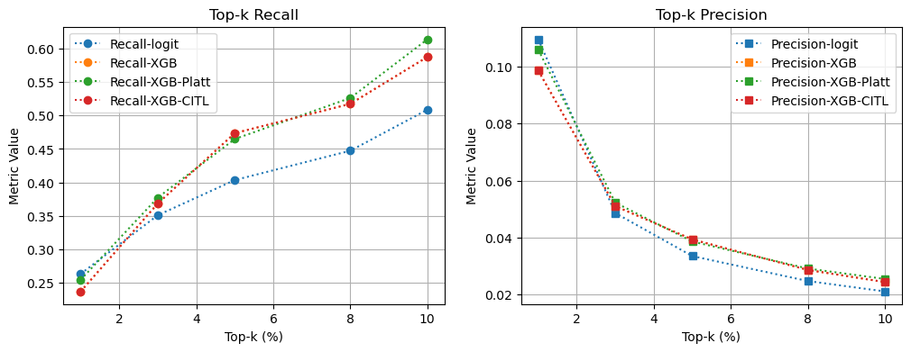

# Oncology Readmission Prediction Pilot  
**Predicting unplanned 30-day readmissions in oncology inpatients using structured and text-based EHR data**

---

## Background and Significance
Unplanned readmissions represent a critical quality indicator in oncology care. In our dataset originated from one of China's top hospital, the event rate is only 0.4%, making prediction extremely challenging due to severe class imbalance.

To evaluate the model’s practical value, we compare Top-k Precision (PPV@Top-k) with the baseline event rate.
**The model achieves a PPV around 9–11% among the top 1% of high-risk patients, which is >20× higher than random selection. Even when only the top 3% of high-risk patients are flagged, the model achieves a PPV over 5%**
This highlights the potential for targeted intervention and efficient resource allocation in hospital quality management.

---

## Clinical Goal

Unplanned readmission within 30 days after discharge is a critical quality indicator in oncology care.  
This project aims to **predict unplanned readmission events among hospitalized cancer patients**  
using structured Electronic Health Records (EHR) and prototype-level clinical text data.

**Target population:**  
Adult cancer inpatients (ICD-10: `C11`, `C16`, `C18`, `C20`, `C22`, `C23`, `C24`, `C25`, `C34`, `C50`, `C56`, `C61`, `C64`, `C67`, `C71`, `C79`, etc.)  
across multiple tumor types, surgeries, and adjuvant treatment conditions.

**Clinical motivation:**  
- Reduce preventable readmissions and improve continuity of oncology care.  
- Support hospital quality monitoring and risk-adjusted benchmarking.  
- Provide explainable and reproducible foundations for EHR-based predictive modeling.

---

## Data Source & Composition

**Data origin:**  
Fully de-identified EHR records were extracted for internal model development.  
Sample Size: N = 137243 visits (cancer patient within 202401-202506 timeframe)
Positive rate: ~0.4% (extremely imbalanced)

All data in this repository are synthetic and fully de-identified. No personally identifiable information, timestamps, or hospital identifiers are included. This dataset structure mimics real EHRs solely for research reproducibility.

| File | Description | Notes |
|------|--------------|-------|
| `basic_info.csv` | Patient demographics & admission metadata | Includes gender, age, occupation, region, admission/discharge date |
| `face_sheet.csv` | Diagnosis, surgery, and procedure summary  | Contains ICD-10 and ICD-9-CM codes, surgery types, operation dates |
| `DRG.csv` | DRG-level structured indicators  | Includes comorbidity flags and encoded treatment-related variables |
| `note.csv` | Textual clinical notes (de-identified)  | Includes progress notes, pre-op discussions, and discharge summaries |

---

## Feature Engineering

Feature extraction integrates **clinical reasoning and domain knowledge** to enhance interpretability.

### Structured Features
- **Demographics:** `Gender`, `Age`, `In-city`, `Occupation`
- **Hospitalization:** `Length of stay`, `Fee`, `Visit type`
- **Cancer Type:** ICD-10 codes grouped by organ system  
- **Surgery-related:** `Is_surgery`, `Class 4 surgery`, `Surgery complications`
- **Treatment-related:** `RT under 96h`, `RT over 96h`, `ECMO`, `CRRT`
- **Pre-discharge markers (72h):** `Ascites`, `Fever`, `Positive bacteria`

### Derived Clinical Indices
- **Comorbidity index (CMI weight rignt WR)** based on `DRG.csv`
- **Procedure severity score** from cumulative operation classes
- **Unplanned discharge flag** to link readmission probability

### Text Feature Prototypes
- Token-level extraction from `note.csv` using regular expression to identify mentions of  
  *“infection”, “re-surgery”, “fever”*  
  (used in pilot NER experiments).

---

## Modeling Pipeline

**Data split: 80% train / 20% test**

| Model | Description | Key Parameters |
|--------|--------------|----------------|
| **Logistic Regression (baseline)** | High interpretability, probability-calibrated | `penalty='l2'`, `class_weight='balanced'`, `solver='liblinear'` |
| **XGBoost (tree-based)** | Nonlinear learner with strong imbalance handling | `scale_pos_weight = neg/pos`, `max_depth=4`, temperature scaling applied |

---

## Evaluation Metrics

Beyond standard discrimination, multiple complementary metrics were used to capture clinical relevance.

| Category | Metric | Purpose |
|-----------|---------|----------|
| **Discrimination** | AUC-ROC, AUPRC | Overall model separability |
| **Sensitivity–Specificity** | Recall, Precision | Evaluate ability to detect true readmissions |
| **Calibration** | Brier Score | Assess reliability of probability outputs |
| **Operational** | Top-k Recall / Precision | Simulate screening workload–benefit tradeoff |

## Calibration Needed
The raw XGBoost model achieved strong discrimination (AUROC ≈ 0.86) but poor calibration, reflected by a high Brier score (~0.089) and overconfident predicted probabilities — i.e., the model systematically overestimated the risk of readmission.

 

## Calibration Method
The raw XGBoost model produced a relatively high Brier score, suggesting poor calibration of predicted probabilities.
To address this, two complementary calibration methods were applied:
1.	Platt Scaling (Sigmoid method)
2.	CITL Intercept Adjustment

---

## Example results (synthetic dataset):

| Model | Recall@0.05 | Precision@0.05 | AUROC | Brier |
|--------|-------------|----------------|--------|--------|
| Logistic Regression | 0.40 | 0.034 | 0.79 | 0.0167 |
| XGBoost | 0.47 | 0.039 | 0.86 | 0.0889 |
| Platt Calibrated XGB| 0.47 | 0.039 | 0.86 | 0.004 |
| CITL Calibrated XGB| 0.47 | 0.039 | 0.86 | 0.004 |

**Interpretation:**  
1. Platt scaling effectively reshaped the predicted probability distribution — reducing extreme overconfidence and aligning predicted risk levels with observed event frequencies.
The reliability diagram showed near-diagonal alignment post-calibration.
Particularly improved for moderate-risk patients (predicted 1–5% probability range).
2. CITL adjustment refined the intercept bias without altering rank order.
Reduced average deviation between predicted and true probabilities.
Achieved the lowest Brier score (0.004) while maintaining identical AUROC and AUPRC.

---

## Key Findings

- **The model achieves a PPV around 9–11% among the top 1% of high-risk patients, which is >20× higher than random selection. Even when only the top 3% of high-risk patients are flagged, the model achieves a PPV over 5%**
- **Tree models** better capture nonlinear interactions between surgery, infection, and readmission risk.  
- **Feature importance** highlights post-operative infection, RT, ECMO, CRRT as top predictors.

---

## Future Research Directions

1. **Multimodal Feature Fusion**  
   Combine structured features with clinical text embeddings (Transformer / TabTransformer).

2. **Temporal Modeling**  
   Model hospitalization as a time series (Patient × Time × Indicators)  
   using RNN / Temporal Fusion Transformer to learn disease progression dynamics.

3. **Clinical Text Mining (NER & Relation Extraction)**  
   Train domain-specific NER models on `note.csv` to extract entities  
   such as *diagnosis, treatment, and complications* for graph-based representation.

4. **Causal Inference & Explainability**  
   Use SHAP / LIME and Causal Graphs to analyze causal contribution  
   of surgery type, comorbidities, and interventions to readmission risk.

5. **Federated Learning & External Validation**  
   Collaborate across institutions using **privacy-preserving federated training**  
   to enhance model generalization and fairness.

---

## Repository Structure

    oncology_readmission_prediction_pilot/
    │
    ├── data/
    │   ├── basic_info.csv
    │   ├── DRG.csv
    │   ├── face_sheet.csv
    │   ├── note.csv
    │   └── data_readme.md    
    │
    ├── notebooks/
    │   ├── 01_data_exploration.ipynb
    │   └── 02_build_dataset_and_model.ipynb      
    │
    ├── src/
    │   └── data_cleaning_func.py               
    │
    └── README.md
---

## Environment

| Library | Version |
|----------|----------|
| Python | 3.10+ |
| pandas | 2.1 |
| numpy | 1.26 |
| scikit-learn | 1.5 |
| xgboost | 2.0 |
| matplotlib | visualization |
---

### This pilot validates the feasibility of EHR-based oncology readmission prediction and establishes a modular, reproducible foundation for future research in multimodal, explainable model in medical application.
